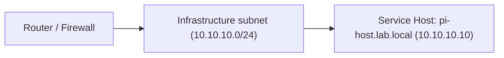

## Home Network-Lab & Self‑Hosting Environment

This repository documents my home network lab and self‑hosting environment.
It is written as a **portfolio‑safe technical case study**, not a deployment guide.

The focus is on:
- Practical routed home networking (segmentation, firewall intent, QoS concepts)
- Self‑hosting services on constrained hardware using Docker
- Home Assistant UI design with reliability and observability in-mind
- Re-purposing & recycling hardware securely
- Making failure modes visible and boring

> **Important**
> - No live IPs, hostnames, serials, MACs, or credentials exist in this repo
> - All network values use a **placeholder subnet: `10.10.10.0/24`**
> - Configs are intentionally incomplete and non‑functional by themselves

---

## Current lab state (high level)

**Compute**
- Raspberry Pi 4B
- Docker (single‑node)

**Services**
- Home Assistant (container)
- Pi‑hole
- Audiobookshelf
- Folding@home (CPU‑limited)
- Watchtower (Updates)
- USB‑attached storage (non‑HA)

**Network principles**
- Private RFC1918 addressing only
- Segmentation by intent (not device sprawl)
- Default‑deny between segments; explicit allow rules
- Observability > cleverness

Details live under `docs/`.

---

## Repository layout

All documentation lives under `docs/`.

The repository intentionally avoids configuration files, scripts, or
deployable artefacts. The focus is on design intent and operational lessons,
not reproducible builds.

---

## High‑level topology (abstracted)

This diagram shows routing and service placement only.
Endpoints, client devices, and physical layout are intentionally omitted.

---

## Redaction rules (non‑negotiable)

Before any public commit:
- No WAN interfaces, ISP identifiers, or modem screenshots
- No MACs, serials, QR codes, or licensing artefacts
- No full firewall rule dumps
- No screenshots containing client names or addresses

See: `docs/00-scope-and-redaction.md`

